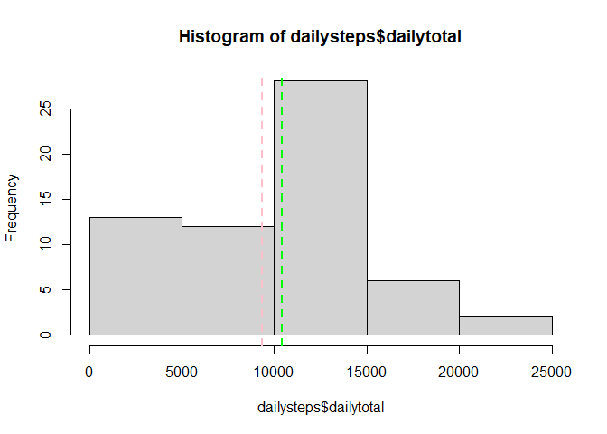
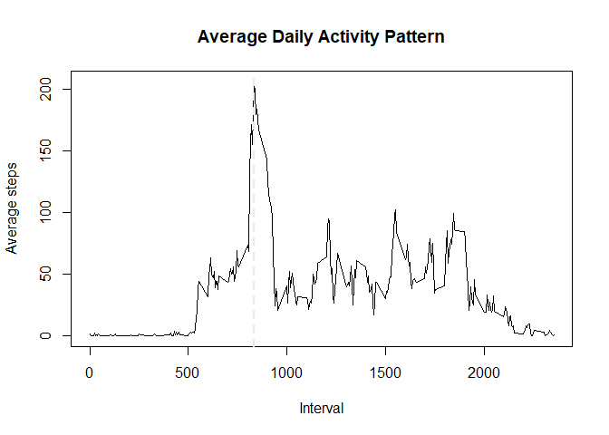
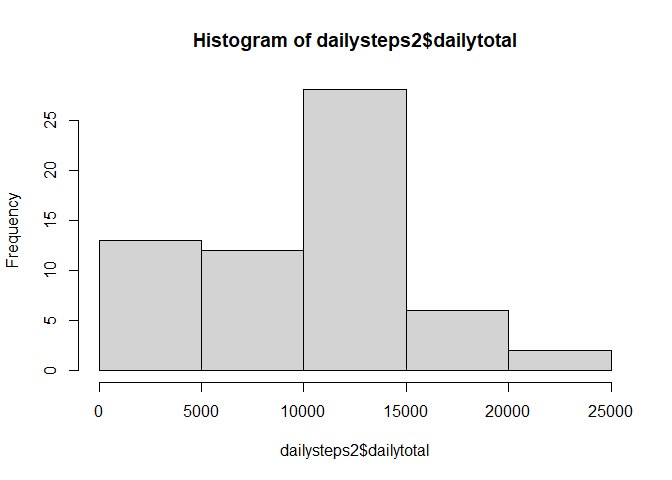
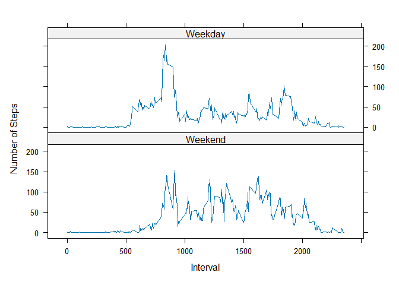

## Loading and preprocessing the data
Data from the "activity.csv" file in the working directory is read into a 
variable named "data", and the values in the "date" column are
converted into dates in the POSIXlt format.


``` r
data<-read.csv("activity.csv")
data$date <-as.POSIXlt(data$date)
```


## What is mean total number of steps taken per day?

``` r
library(dplyr)
dailysteps <- data %>% group_by(date) %>% summarize(dailytotal = sum(steps, na.rm = TRUE))
hist(dailysteps$dailytotal)
dailymean<-mean(dailysteps$dailytotal)
dailymedian<-median(dailysteps$dailytotal)
abline(v=dailymean, lty = 2, lwd = 2, col= "pink")
abline(v = dailymedian, lty = 2, lwd = 2, col = "green")
```

<!-- -->
  
The mean total number of steps taken per day is 9354.2295082, marked in pink.
The median number of steps taken per day is 10395, marked in green. 

## What is the average daily activity pattern?
The average daily activity pattern looks as follows: 


``` r
intavg<- data%>% group_by(interval) %>% summarize(avg = mean(steps, na.rm=TRUE))
plot(intavg$interval, intavg$avg, type = "l", xlab = "Interval", ylab = "Average steps", main = "Average Daily Activity Pattern")
avg_max<-intavg$interval[which.max(intavg$avg)]
abline(v = avg_max, lty = 2, lwd = 2, col = "lavender")
```

<!-- -->
  
The lavender line marks the interval that has the highest average step count,
the interval starting at 835. 


## Imputing missing values

To fill in missing numbers, the following approach was used: 
The missing measurement is calculated as the mean of the two neighboring measurements. 
If there are no two neighboring measurements (eg one or both are also NA, or the
measurement in question is from the first or the last interval of the day), the
non-existent measurements are considered to be zero. 


``` r
numNA<-sum(is.na(data$steps))
indexNA<-which(is.na(data$steps))
data2<-data
for(i in indexNA){
        if(i == 1 & is.na(data2$steps[i+1])){
                data2$steps[i] <- 0
        }
        else if(i == 1 & !is.na(data2$steps[i+1])){
                data2$steps[i] <-data2$steps[i+1]/2
        }
        else if(is.na(data2$steps[i-1]) & is.na(data2$steps[i+1])){
                data2$steps[i] <- 0
        }
        else if((data2$interval[i] == 0 & !is.na(data2$steps[i+1])) | is.na(data2$steps[i-1])){
                data2$steps[i] <- data2$steps[i+1]/2
        }
        else if((data2$interval[i] == max(data2$interval) & !is.na(data2$steps[i-1])) | is.na(data2$steps[i+1])){
                data2$steps[i] <- data2$steps[i-1]/2
        }
        else{
        data2$steps[i] <= mean(data2$steps[i-1], data2$steps[i+1])
        }
}
```

The dataset had a total of 2304 missing values. Analyzing the data set 
with the imputed values: 


``` r
dailysteps2 <- data2 %>% group_by(date) %>% summarize(dailytotal = sum(steps, na.rm = TRUE))
hist(dailysteps2$dailytotal)
```

<!-- -->

``` r
dailymean2<-mean(dailysteps2$dailytotal)
dailymedian2<-median(dailysteps2$dailytotal)
```
  
The new daily mean is 9354.2295082 and the new daily median is 1.0395\times 10^{4}.
These values are slightly different from those from the original dataset, since
previously omitted NA measurements now have values (many of which are zero or 
close to zero) that are taken into account when calculating average and median. 
If the values were imputed in a different way, eg. by filling in the average
number of steps for a given interval, the average and median would also be different. 


## Are there differences in activity patterns between weekdays and weekends?

``` r
library(lattice)
Weekend <- c("Saturday","Sunday")
data4<-data2
data4$Type<- factor(weekdays(data4$date) %in% Weekend, levels = c(TRUE, FALSE), labels = c("Weekend","Weekday"))
data4<- group_by(data4, Type, interval) %>% summarize(stepavg = mean(steps))
xyplot(stepavg ~ interval | Type, data = data4, layout = c(1,2), type = "l", xlab = "Interval", ylab = "Number of Steps")
```

<!-- -->
    
As is shown in the figure, there are some slight differences in the activity patterns
between weekdays and weekends, particularly higher activity in the morning on weekdays, 
possibly walking a dog or the commute to work. Meanwhile on weekends, the activity
seems to start later and be more spread out throughout the day. 
